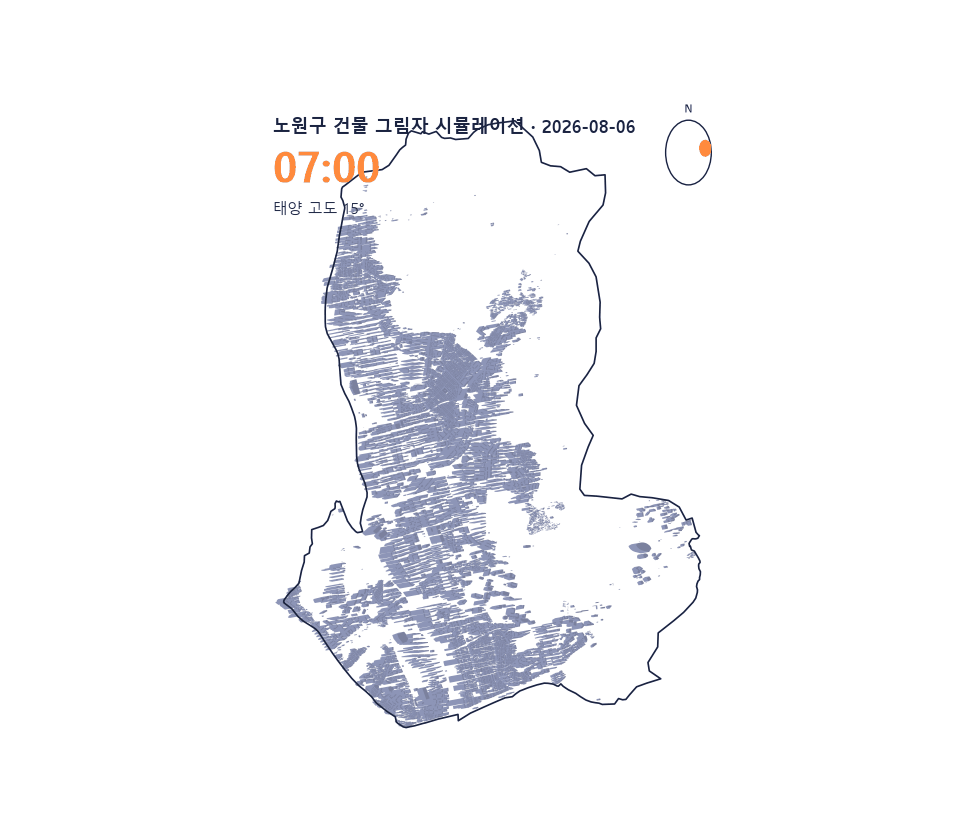

# 그늘로 (gneulro)

**태양을 피하는 그늘 경로 내비게이션** — 노원구 건물 그림자를 물리 계산해
"최단경로 vs 그늘경로"를 비교하고 최적 출발시각을 추천한다.

<p align="center">
  
</p>

## 배경 · 목적

여름 폭염에서 '가장 빠른 길'과 '가장 덜 더운 길'은 다르다. 공개된 도시 데이터(건물·가로수·S-DoT)로 거리 위 그늘을 정량화하면, 보행자는 몇 분의 추가 시간으로 체감 온도를 크게 낮출 수 있다. 흩어진 공공데이터를 하나의 **판단 가능한 신호**로 엮는 것이 목표다.

## 아키텍처

```
공공데이터(건물 shp·가로수·S-DoT)
  → 배치 파이프라인 (그림자 계산 → 50m 격자 그늘율 → 보행망 가중치)
  → 저장소 (PostGIS 또는 GeoParquet — USE_POSTGIS로 전환)
  → FastAPI (/api/shade /grid /route /departure)
  → Leaflet 웹 지도 (클릭 2번 → 경로 비교)
```

## 파일 구조

| 경로 | 역할 |
|---|---|
| `pipeline/01~09_*.py` | 배치 파이프라인 (준비 → 그림자 → 격자 → 그래프 → 검증 → SDI → 타임랩스 → 장소 → 프레임) |
| `src/gneulro/` | 코어 모듈 (`shadowcast` · `grid` · `graph` · `departure` · `store` · `validate` …) |
| `api/main.py` | FastAPI 서버 (`/shade` `/grid` `/route` `/departure`) |
| `web/index.html` · `web/3d.html` | Leaflet 지도 · 3D 뷰 |
| `reports/` | 산출물 (그늘 타임랩스 · top10 · PoC) |
| `docs/SPEC.md` 등 | 사양 · 기획 · 핸드오프 |

## 실행 방법

```bash
# 0. 준비
python -m venv .venv && .venv/Scripts/activate   # Windows
pip install -e ".[dev]"
copy .env.example .env        # 파일 모드는 USE_POSTGIS=false 로 변경

# (선택) PostGIS 모드: docker compose up -d

# 1. 데이터 배치 (docs/SPEC.md §3 참고, data/raw/에 수동 다운로드)

# 2. 배치 파이프라인
python pipeline/01_prepare.py
python pipeline/02_shadows.py
python pipeline/03_grid.py
python pipeline/04_graph.py
python pipeline/05_validate.py   # S-DoT 보조 검증 (reports/ 산출)

# 3. 서버 → http://localhost:8000
uvicorn api.main:app --reload
```

## 검증

```bash
ruff check .
pytest
```

## 알려진 한계

- 그림자는 convex hull 1차 근사 — 오목(ㄷ자) 건물은 과대 추정될 수 있음.
- 태양각은 노원구 중심점 1회 계산 (구 규모에서 공간 차이 무시 가능).
- S-DoT 검증은 상관관계의 **보조적 확인**이며 인과 증명이 아님.

## 의의

도메인 지식(도시·기상) → 물리 모델링 → 공간 데이터 파이프라인 → 서비스 API까지, 원시 공공데이터를 실사용 가능한 의사결정 신호로 바꾸는 전 과정을 직접 설계했다. **데이터가 판단을 받치는 구조**를 만드는 연습.
